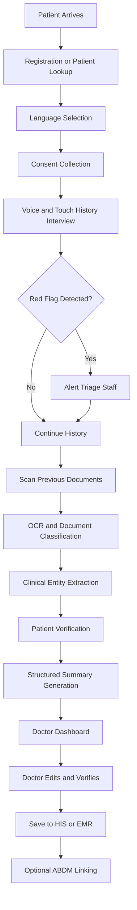
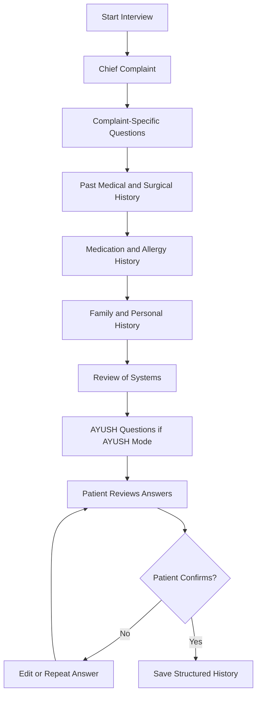
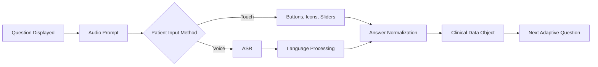
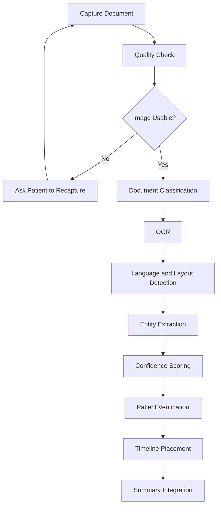
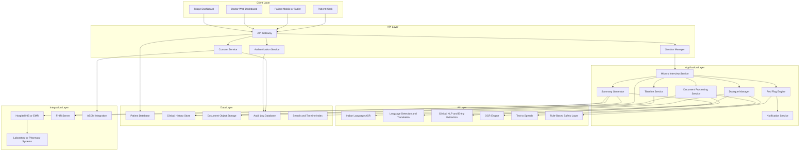
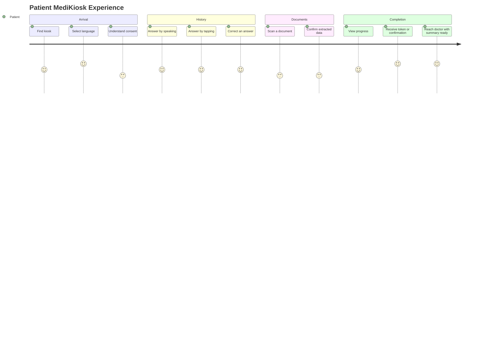
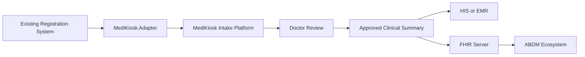

# SIH26047 — Patient Case-Taking Software  
## Proposed Solution: MediKiosk

---

# 1. Problem Statement Breakdown

## 1.1 Core Problem

Government and AYUSH hospitals manage thousands of OPD patients daily, but doctors often get only **2–5 minutes per patient**. This creates:

- Incomplete clinical history
- Repeated questioning across visits
- Missed allergies, medications, comorbidities, and previous procedures
- Poor documentation
- Long OPD queues
- Delayed identification of emergency symptoms
- Difficulty reviewing paper-based medical records

## 1.2 Major Problem Areas

### A. Clinical History-Taking Bottleneck

The physician needs to collect:

- Chief complaint
- History of present illness
- Past medical history
- Past surgical history
- Drug history
- Allergy history
- Family history
- Personal and social history
- Review of systems
- Previous investigations

However, this process is time-consuming and often incomplete.

### B. Patient Diversity

The system must support:

- Hindi, English, and regional languages
- Elderly patients
- Low-literacy patients
- Rural and first-time hospital visitors
- Patients with limited smartphone experience
- Patients uncomfortable with typing
- Patients who prefer voice interaction

### C. Paper-Based Medical Records

Patients may carry:

- Prescriptions
- Laboratory reports
- Discharge summaries
- Imaging reports
- Referral notes
- Surgery records
- Handwritten medical documents

These documents are often:

- Unstructured
- In different languages
- Chronologically disorganized
- Difficult to read
- Not digitally connected to hospital records

### D. AYUSH-Specific Requirements

Ayurvedic consultation may require:

- Prakriti
- Vikriti
- Sara
- Samhanana
- Pramana
- Satmya
- Sattva
- Ahara Shakti
- Vyayama Shakti
- Vaya
- Agni
- Koshtha
- Ahara-Vihara
- Nidana
- Samprapti

A generic allopathic intake form does not adequately support this workflow.

### E. Lack of Interoperability

Existing registration software commonly stores only:

- Patient name
- Age
- Gender
- Contact number
- Appointment
- Department
- Token number

It usually does not provide:

- Structured clinical history
- OCR-based medical record extraction
- ABHA-linked records
- FHIR-based exchange
- Physician-editable AI summaries
- Consent tracking

---

# 2. Proposed Solution

## 2.1 Solution Name

## MediKiosk

An AI-powered, multilingual, patient-facing clinical intake platform that enables patients to:

1. Register or identify themselves
2. Give their medical history through voice or touch
3. Scan previous medical documents
4. Receive adaptive clinical questions
5. Detect possible red-flag symptoms
6. Generate a structured medical history
7. Share the summary with the doctor after consent
8. Connect relevant data with the hospital system and ABDM ecosystem

## 2.2 Main Objective

> To collect a comprehensive, structured, and verifiable patient history before doctor consultation, thereby reducing documentation burden and improving OPD efficiency without replacing the physician.

---

# 3. Solution Modules

## Module A — Patient Registration and Consent

### Functions

- New patient registration
- Existing patient lookup
- ABHA ID entry or scan
- Hospital ID/token lookup
- Language selection
- Audio-guided consent
- Consent withdrawal or cancellation
- Optional demographic verification

### Important Design Principle

Aadhaar should not be treated as the default medical identifier. The system should prioritize:

- ABHA ID
- Hospital patient ID
- Token number
- Consent-based identity matching

---

## Module B — Conversational Clinical History Engine

### Functions

- Voice-based interview
- Touch-based questionnaire
- Language selection
- Automatic translation where required
- Adaptive follow-up questions
- Clinical history completeness tracking
- Patient confirmation before final submission

### Example

If the patient says:

> “I have chest pain.”

The system may ask:

- When did the pain start?
- Is it continuous or intermittent?
- Where exactly is the pain?
- Does it spread to the arm, jaw, shoulder, or back?
- Is it burning, squeezing, stabbing, or heavy?
- Does it increase on walking?
- Is there breathlessness, sweating, dizziness, or vomiting?
- Has this happened before?

### Clinical Frameworks

The system can use complaint-specific templates such as:

- SOCRATES for pain
- OPQRST for symptom analysis
- Respiratory symptom template
- Gastrointestinal symptom template
- Neurological symptom template
- Obstetric and gynaecological template
- Paediatric template
- AYUSH/Dashavidha Pariksha template

The framework should support clinician-approved question paths rather than unrestricted AI questioning.

---

## Module C — Red-Flag Detection

### Potential Red Flags

- Severe chest pain with breathlessness
- Facial deviation or limb weakness
- Severe bleeding
- Unconsciousness
- Sudden severe headache
- Severe allergic reaction
- Pregnancy-related emergency symptoms
- Severe abdominal pain with shock-like symptoms
- Suicidal thoughts or immediate mental-health risk

### Action

The system should not diagnose. It should:

1. Detect a predefined emergency pattern
2. Stop routine questioning if necessary
3. Display and play an urgent message
4. Alert the triage desk
5. Assign a priority flag
6. Record the alert in the audit trail

### Example Alert

> “Possible urgent symptoms detected. Please wait. A healthcare worker has been notified.”

---

## Module D — Medical Document Digitization

### Workflow

- Capture document image through scanner or camera
- Detect document boundaries
- Improve image quality
- Perform OCR
- Identify document type
- Extract medical entities
- Ask patient to verify extracted information
- Add the record to the medical timeline

### Documents Supported

- Printed prescriptions
- Handwritten prescriptions
- Lab reports
- Discharge summaries
- Referral letters
- Imaging reports
- Operation notes
- Medication lists
- Vaccination records

### Extracted Data

- Date
- Hospital or provider
- Diagnosis
- Medication name
- Dosage
- Frequency
- Duration
- Investigation name
- Result
- Unit
- Reference range
- Procedure
- Surgery
- Allergy
- Follow-up instruction

### Important Limitation

OCR output must be labelled as:

- Extracted
- Patient-verified
- Physician-verified

No extracted information should be treated as clinically confirmed until verified by a healthcare professional.

---

## Module E — Timeline Generator

The system creates a chronological view of:

- Previous illnesses
- Hospital admissions
- Surgeries
- Investigations
- Medication changes
- Allergies
- Major clinical events

### Example

```text
2019 ── Diabetes diagnosed
2021 ── Cataract surgery
2023 ── High blood pressure reported
2024 ── Kidney function test performed
2026 ── Current OPD complaint
```

---

## Module F — Structured Summary Generator

### Physician-Facing Summary

```text
Patient Identification
Chief Complaint
History of Present Illness
Past Medical History
Past Surgical History
Drug History
Allergy History
Family History
Personal and Social History
Review of Systems
Previous Investigations
Current Medications
AI-Detected Alerts
Patient-Reported Information
OCR-Extracted Information
Unverified Fields
```

### Summary Requirements

- Concise
- Chronological
- Bilingual if required
- Editable
- Source-linked
- Confidence-labelled
- Non-diagnostic
- Physician-verifiable

---

## Module G — Doctor Review Dashboard

The doctor should be able to:

- View the complete summary
- Open the original scanned document
- See extracted text beside the image
- Correct errors
- Add missing information
- Mark data as verified
- Reject incorrect entries
- View red-flag alerts
- Add clinical notes
- Export or save the final record
- Push approved data to HIS/EMR

---

## Module H — ABDM and HIS Integration

### Possible Integration Components

- ABHA lookup
- Consent artefact management
- FHIR-based clinical data exchange
- Hospital patient ID mapping
- HIS/EMR record update
- Digital health record linking
- Doctor authentication
- Access audit logs

### Integration Principle

The prototype should use a modular integration layer so that it can initially work with mock APIs and later connect to:

- Hospital Information System
- Electronic Medical Record
- ABDM ecosystem
- FHIR server
- Laboratory Information System
- Pharmacy system

---

# 4. Minimum Viable Product

The MVP should demonstrate the complete patient-to-doctor workflow without trying to solve every possible clinical scenario.

## 4.1 MVP Scope

### Patient Side

- Language selection: Hindi and English
- New patient or existing patient flow
- Consent screen
- Basic demographics
- Voice and touch input
- History collection for 3–5 common complaints
- Patient confirmation screen
- Document image upload
- OCR for printed documents
- Basic extraction of medicines and laboratory values
- Structured summary generation
- Mock ABHA/HIS integration

### Doctor Side

- Doctor login
- Patient queue
- Structured history summary
- Original document preview
- Extracted information
- Red-flag alert
- Edit and verify functionality
- Final submission

## 4.2 Recommended MVP Complaints

Choose common and demonstrable cases:

1. Fever
2. Cough and breathlessness
3. Chest pain
4. Abdominal pain
5. Headache

For the SIH demonstration, **chest pain and fever** are useful because they demonstrate both adaptive questioning and red-flag detection.

## 4.3 MVP AYUSH Extension

The MVP can include a limited AYUSH module with:

- Prakriti
- Agni
- Koshtha
- Ahara
- Vihara
- Sleep
- Bowel habits
- Current symptoms
- Selected Dashavidha Pariksha parameters

The complete Ayurvedic framework can be included in the product roadmap.

## 4.4 MVP Exclusions

To control scope, the first prototype should not attempt:

- Autonomous diagnosis
- Autonomous prescription
- Fully reliable handwritten OCR for all scripts
- Real-time integration with every hospital HIS
- Complete support for all Indian languages
- Automatic drug-interaction decisions
- Direct emergency medical intervention
- Unverified patient-generated data being written permanently into the medical record

---

# 5. MVP Demonstration Scenario

## Scenario

A patient arrives at a government hospital with chest discomfort and previous laboratory reports.

### Patient Flow

1. Selects Hindi
2. Scans ABHA card or enters temporary patient ID
3. Listens to consent explanation
4. Gives consent
5. Reports chest pain through voice
6. Answers adaptive questions
7. Reports sweating and breathlessness
8. System generates a red-flag alert
9. Triage staff receives the alert
10. Patient scans a previous lab report
11. OCR extracts cholesterol and blood sugar values
12. Patient confirms the extracted values
13. System creates a structured history summary
14. Doctor opens the summary
15. Doctor reviews, corrects, and confirms it

---

# 6. End-to-End Working Methodology

## 6.1 High-Level Process



---

## 6.2 Patient History Workflow



---

## 6.3 Voice and Touch Interaction



---

## 6.4 Document Processing Workflow



---

# 7. Solution Architecture

## 7.1 Architecture Diagram



---

## 7.2 Recommended Technology Stack

| Layer | Recommended Technology |
|---|---|
| Patient kiosk UI | React, Next.js, Flutter, or Android |
| Doctor dashboard | React or Angular |
| Backend APIs | FastAPI, Node.js, or Spring Boot |
| Database | PostgreSQL |
| Document storage | S3-compatible object storage |
| Search and timeline | OpenSearch or PostgreSQL indexing |
| ASR | Bhashini, AI4Bharat, or approved Indian-language ASR |
| OCR | PaddleOCR, Tesseract, cloud OCR, or medical OCR model |
| NLP | Clinical NLP model plus constrained LLM |
| TTS | Bhashini or Indian-language TTS |
| Authentication | OAuth2, OpenID Connect, hospital identity provider |
| Integration | FHIR APIs and REST APIs |
| Deployment | Hospital private cloud, government cloud, or secure hybrid cloud |
| Monitoring | Centralized logs, audit trails, metrics, and alerts |

---

# 8. Data Collection

## 8.1 Data Sources

### Patient-Generated Data

- Voice responses
- Touch responses
- Patient-entered demographics
- Consent selections
- Confirmation and correction actions

### Document Data

- Prescription images
- Lab report images
- Discharge summary images
- Referral notes
- Imaging reports

### Hospital Data

- Patient ID
- Department
- Token number
- Appointment details
- Previous encounters
- Doctor assignment

### ABDM-Related Data

- ABHA identifier
- Consent information
- Shared health record references
- FHIR resources, where integration is available

---

## 8.2 Data Collection Principles

- Collect only necessary information
- Explain why each category is required
- Use explicit consent
- Use local-language audio instructions
- Allow patients to skip non-mandatory questions
- Allow correction of answers
- Record the source of every data element
- Never silently infer sensitive medical details
- Separate patient-reported information from verified clinical information

---

## 8.3 Sample Structured Data Object

```json
{
  "patient_id": "HOSP-2026-001245",
  "language": "hi-IN",
  "consent": {
    "history_capture": true,
    "document_processing": true,
    "doctor_sharing": true,
    "abdm_linking": false
  },
  "chief_complaint": {
    "value": "Chest pain",
    "source": "voice",
    "confidence": 0.96,
    "patient_verified": true
  },
  "history_of_present_illness": {
    "onset": "2 hours ago",
    "character": "pressure-like",
    "radiation": "left arm",
    "associated_symptoms": [
      "breathlessness",
      "sweating"
    ],
    "source": "voice",
    "patient_verified": true
  },
  "red_flag": {
    "status": true,
    "reason": "Chest pain with breathlessness and sweating",
    "action": "triage_alert_sent"
  },
  "documents": [
    {
      "document_type": "laboratory_report",
      "date": "2025-11-15",
      "ocr_status": "patient_verified",
      "extracted_entities": [
        {
          "test": "Fasting blood glucose",
          "value": "148",
          "unit": "mg/dL"
        }
      ]
    }
  ]
}
```

---

# 9. Data Processing Pipeline

## 9.1 Voice Processing

```text
Patient speech
      ↓
Noise reduction
      ↓
Language and speech detection
      ↓
Automatic speech recognition
      ↓
Text normalization
      ↓
Clinical entity extraction
      ↓
Question-specific answer mapping
      ↓
Patient confirmation
      ↓
Structured clinical field
```

## 9.2 Document Processing

```text
Document image
      ↓
Blur and quality detection
      ↓
Crop and perspective correction
      ↓
Document classification
      ↓
OCR
      ↓
Layout understanding
      ↓
Medical entity extraction
      ↓
Confidence scoring
      ↓
Patient verification
      ↓
Physician verification
```

## 9.3 Response Generation

The system should generate different outputs for different users.

### Patient Output

- Simple language
- Local-language audio
- Confirmation prompts
- Next-step instructions
- No alarming diagnostic statements

### Triage Output

- Priority flag
- Reason for alert
- Patient location
- Token number
- Relevant symptoms
- Time of detection

### Physician Output

- Structured history
- Chronological timeline
- Medication list
- Allergies
- Abnormal laboratory values
- Source and confidence labels
- Original document links
- Red-flag indicators

### Hospital Administrator Output

- Number of patients processed
- Average intake time
- Completion rate
- Average doctor review time
- Number of triage alerts
- OCR correction rate
- Language-wise usage
- Kiosk uptime

---

# 10. Targeted Users

## 10.1 Primary Users

### Patients

Especially:

- Government hospital OPD patients
- Elderly patients
- Low-literacy users
- Rural patients
- First-time visitors
- Patients carrying paper records
- Patients speaking Indian regional languages
- Patients with limited smartphone access

### Doctors

- General physicians
- Specialists
- AYUSH practitioners
- Medical officers
- Emergency and triage doctors

### Nursing and Triage Staff

- Monitor emergency alerts
- Assist patients
- Handle incomplete sessions
- Escalate urgent cases

---

## 10.2 Secondary Users

- Registration desk staff
- Medical record department
- Hospital administrators
- Medical students
- Public health researchers
- IT administrators
- ABDM or digital health integration teams

---

# 11. Expected User Experience

## 11.1 UX Principles

- Speak first, type less
- One question at a time
- Large buttons
- High contrast
- Minimal text
- Audio instructions
- Local-language support
- Visible progress indicator
- Easy correction
- No technical terminology
- Assisted mode for staff
- Clear privacy explanations

## 11.2 Patient UX Flow



## 11.3 Patient Screen Sequence

### Screen 1 — Welcome

- “Namaste”
- Language selection
- Start button
- Assisted mode button

### Screen 2 — Identity

- Scan ABHA card
- Enter hospital ID
- Continue as new patient
- Staff assistance option

### Screen 3 — Consent

- Audio explanation
- Simple visual icons
- Accept, decline, or ask for help
- Separate consent categories

### Screen 4 — Interview

- Large question text
- Audio playback
- Speak button
- Touch answer options
- Repeat question button
- Progress indicator

### Screen 5 — Document Capture

- Document placement illustration
- Automatic image quality check
- Retake option
- Add another document option

### Screen 6 — Confirmation

- Read-back of major answers
- Edit option
- Submit option

### Screen 7 — Completion

- Token number
- Estimated next step
- Emergency instruction if applicable
- Audio confirmation

---

# 12. Physician Experience

## 12.1 Doctor Dashboard Layout

```text
------------------------------------------------------
Patient Name | Age | Gender | Token | Language
------------------------------------------------------
RED FLAG: Possible urgent symptoms
------------------------------------------------------
Chief Complaint
History of Present Illness
Past History
Medication and Allergy History
Family and Personal History
Review of Systems
------------------------------------------------------
Previous Documents | Timeline | Lab Values
------------------------------------------------------
[Edit] [Verify] [Reject Field] [Save to HIS]
```

## 12.2 Physician Controls

- Expand or collapse sections
- Show only abnormal findings
- View evidence source
- Play original patient audio if permitted
- Open scanned document
- Correct extracted text
- Mark information as verified
- Add clinical notes
- Export summary
- Reject AI-generated content

---

# 13. Privacy, Consent, and Security

## 13.1 Consent Requirements

Consent should clearly cover:

- Clinical history recording
- Voice processing
- Document scanning
- AI-assisted structuring
- Sharing with the treating doctor
- HIS/EMR storage
- ABDM linking
- Future research use, if applicable

These should be separate and granular rather than combined into one broad consent.

## 13.2 Security Measures

- Encryption in transit
- Encryption at rest
- Role-based access control
- Doctor and staff authentication
- Session timeout
- Device locking
- Temporary audio deletion after processing
- Document access logging
- Consent audit trail
- Data retention policy
- Backup and disaster recovery
- Network segmentation
- Secure API gateway

## 13.3 Data Classification

| Data Type | Example | Protection |
|---|---|---|
| Identity data | Name, age, ABHA ID | High |
| Health data | Symptoms, diagnosis history | Very high |
| Biometric-like data | Voice recording | Very high |
| Documents | Prescription, discharge summary | Very high |
| Operational data | Token number | Medium |
| Anonymous analytics | Completion rate | Low to medium |

---

# 14. AI Safety and Clinical Governance

## 14.1 System Must Not

- Diagnose the patient autonomously
- Prescribe medication
- Change a physician's decision
- Hide uncertain information
- Convert low-confidence OCR into confirmed facts
- Delay emergency escalation
- Present AI output as a final medical opinion

## 14.2 Required Safety Controls

- Rule-based red-flag engine
- Clinician-approved question bank
- Confidence scoring
- Source attribution
- Patient confirmation
- Doctor verification
- Audit trail
- Human override
- Safe fallback to manual intake
- Offline or degraded-mode operation

## 14.3 Confidence Display

Example:

```text
Medication: Metformin 500 mg
Source: Scanned prescription
OCR confidence: Medium
Patient verified: Yes
Physician verified: No
```

---

# 15. Dependencies

## 15.1 Technical Dependencies

- Kiosk or tablet hardware
- Microphone and speaker
- Document scanner or camera
- Stable hospital network
- Secure server or cloud environment
- ASR service
- TTS service
- OCR engine
- Clinical NLP model
- Database
- HIS/EMR APIs
- FHIR server
- ABDM integration access

## 15.2 Operational Dependencies

- Hospital administration approval
- Doctor and nurse participation
- Patient assistance staff
- Language and clinical content validation
- Triage escalation protocol
- Consent policy
- Data retention policy
- IT support and maintenance
- Device cleaning and physical security

## 15.3 Regulatory and Governance Dependencies

- Applicable data protection compliance
- Hospital ethics and governance approval
- ABDM integration guidelines
- User consent framework
- Role-based access policy
- Clinical validation of questionnaires
- Medical device classification review, if applicable

---

# 16. Migration Strategy from Existing Systems

The system should not require immediate replacement of existing registration or HIS software.

## 16.1 Phase 1 — Standalone Pilot

- Deploy MediKiosk separately
- Use temporary patient IDs
- Generate downloadable summaries
- Doctor accesses a separate dashboard
- No live HIS integration required

## 16.2 Phase 2 — Registration Integration

- Connect to hospital registration system
- Import patient name, age, gender, department, and token
- Return completion status and summary ID

## 16.3 Phase 3 — HIS/EMR Integration

- Map MediKiosk data to hospital records
- Push only doctor-approved data
- Preserve original document references
- Add audit trails

## 16.4 Phase 4 — FHIR and ABDM Integration

- Map data to appropriate FHIR resources
- Implement consent management
- Support ABHA-linked record sharing
- Enable patient-controlled sharing

## 16.5 Migration Diagram



---

# 17. Feature Extension Roadmap

## Phase 1 — Prototype

- Hindi and English
- Basic patient registration
- Voice and touch history
- Five complaint pathways
- Printed document OCR
- Structured summary
- Doctor dashboard
- Mock integration
- Red-flag alert

## Phase 2 — Pilot

- More languages
- Regional accent improvement
- Better handwritten OCR
- AYUSH history module
- Staff-assisted mode
- Offline queueing
- Hospital integration
- Usage analytics

## Phase 3 — Production

- ABDM integration
- FHIR interoperability
- Multi-hospital deployment
- Role-based administration
- Device management
- Advanced audit and monitoring
- Human review workflows

## Phase 4 — Advanced Features

- Personal health record timeline
- Follow-up visit comparison
- Medication adherence questions
- Patient education
- Voice-based report explanation
- Specialist-specific intake
- Paediatric and obstetric modules
- Mental-health screening with appropriate safeguards
- Population-level anonymized analytics

---

# 18. Scalability and Extensibility

## 18.1 Modular Design

Each major capability should be an independent service:

- Registration
- Consent
- Interview
- OCR
- NLP
- Summary
- Notifications
- Integration
- Analytics

This allows new modules to be added without rebuilding the entire platform.

## 18.2 Configuration-Based Clinical Questionnaires

Questionnaires should be stored as configurable templates rather than hard-coded.

```json
{
  "complaint": "fever",
  "questions": [
    {
      "id": "fever_duration",
      "text": "How long have you had fever?",
      "type": "duration",
      "required": true
    },
    {
      "id": "associated_symptoms",
      "text": "Do you have cough, vomiting, or body ache?",
      "type": "multi_select",
      "required": false
    }
  ]
}
```

This allows hospitals to add:

- New symptoms
- Specialty-specific questions
- AYUSH questionnaires
- Paediatric templates
- Department-specific workflows

## 18.3 API-First Integration

The platform should expose APIs for:

- Patient lookup
- Session creation
- Consent recording
- History retrieval
- Document upload
- Summary retrieval
- Doctor verification
- HIS submission
- Audit access

---

# 19. Prototype Architecture for SIH

## 19.1 Suggested Prototype Components

### Frontend

- Patient kiosk interface
- Doctor dashboard
- Triage alert panel
- Admin analytics page

### Backend

- User and patient management
- Session management
- Questionnaire engine
- OCR processing
- Summary generation
- Alert service
- Mock HIS connector

### AI Demonstration

For the prototype, use:

- Predefined clinical question flows
- Speech-to-text API or mock voice input
- OCR API or sample document processing
- Rule-based red-flag detection
- Controlled LLM summarization
- Text-to-speech for Hindi and English

## 19.2 Suggested Demo Data

Prepare three synthetic patient cases:

### Case 1 — Routine Fever

- Fever for three days
- Body ache
- No emergency symptoms
- Previous CBC report

### Case 2 — Chest Pain Red Flag

- Chest pressure
- Breathlessness
- Sweating
- Previous diabetes history
- Immediate triage alert

### Case 3 — AYUSH Consultation

- Digestive complaints
- Irregular diet
- Sleep disturbance
- Agni and Koshtha questions
- Dashavidha Pariksha summary

Use synthetic data only in the prototype.

---

# 20. Success Metrics

## 20.1 Patient Metrics

- Percentage of patients completing intake
- Average completion time
- Voice versus touch usage
- Language-wise completion rate
- Assistance requests
- Patient correction rate

## 20.2 Clinical Metrics

- Average doctor review time
- History completeness
- Number of missed fields
- OCR verification rate
- Red-flag detection sensitivity
- False-alert rate
- Percentage of summaries edited by doctors

## 20.3 Hospital Metrics

- OPD throughput
- Reduction in registration-to-consultation time
- Reduction in repeated questioning
- Kiosk uptime
- HIS integration success rate
- Number of patients processed per kiosk per day

## 20.4 Suggested Pilot Targets

These can be presented as prototype goals rather than guaranteed outcomes:

- Complete patient intake within 8–12 minutes
- Reduce physician history-taking time by 30–50%
- Achieve over 80% completion for supported questions
- Make 100% of AI summaries physician-editable
- Route 100% of configured red-flag cases to triage review
- Maintain full auditability of shared data

---

# 21. Key Differentiators

- Designed for Indian public hospital OPDs
- Patient-facing rather than only doctor-facing
- Works through voice and touch
- Supports multilingual and low-literacy users
- Includes clinical history, not merely registration
- Digitizes previous paper documents
- Supports AYUSH history-taking
- Includes emergency red-flag routing
- Produces physician-ready summaries
- Consent-first and ABDM-compatible
- Designed to integrate with existing systems
- Keeps the physician in control

---

# 22. One-Line Value Proposition

> MediKiosk converts a patient’s spoken history, touch responses, and paper medical records into a verified, structured clinical summary before consultation, helping doctors spend less time documenting and more time treating.

---

# 23. Recommended SIH Prototype Story

Use the following narrative during the demonstration:

```text
A patient enters a busy government hospital OPD.
The patient selects Hindi and gives consent using audio guidance.
MediKiosk collects the history through voice and touch.
When the patient reports chest pain with breathlessness and sweating,
the system immediately alerts the triage team.
The patient then scans an old laboratory report.
The system extracts relevant values, asks the patient to verify them,
and creates a chronological medical summary.
The doctor opens the dashboard, reviews the summary, corrects one field,
and submits the verified record to the hospital system.
```

This single workflow demonstrates:

- Multilingual accessibility
- Voice interaction
- Touch fallback
- Adaptive questioning
- Red-flag detection
- Document OCR
- Timeline generation
- Human verification
- Doctor dashboard
- HIS integration concept
- Patient safety and privacy

---

# 24. Suggested PPT Structure

1. Title Slide  
2. Problem Statement  
3. Impact of the Current System  
4. Existing Solutions and Their Limitations  
5. Proposed Solution: MediKiosk  
6. Target Users  
7. Patient Journey  
8. Core Modules  
9. AI-Powered History-Taking Workflow  
10. Medical Document Digitization Workflow  
11. Solution Architecture  
12. Data Collection and Processing  
13. Doctor Dashboard  
14. AYUSH Mode  
15. Privacy, Consent, and Security  
16. MVP Scope  
17. Prototype Demonstration  
18. Integration and Migration Strategy  
19. Scalability and Future Extensions  
20. Expected Impact  
21. Technology Stack  
22. Team Roles and Responsibilities  
23. Business or Deployment Model  
24. Conclusion