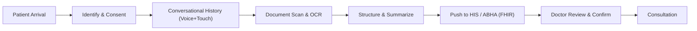

Great — you’ve picked a high-impact, well-scoped problem. Below is a structured, prototype-ready breakdown tailored for SIH 2026, with clear modules, MVP scope, workflows (Mermaid), and a practical data/UX plan. I’ll keep it concise and implementation-focused.

## 1) Problem Statement Breakdown (SIH26047)

- Core bottleneck: OPD consultation time in India is 2–5 minutes; history-taking (the most diagnostic part) is systematically truncated. [play.google](https://play.google.com/store/apps/details?id=com.medoc.doctor&hl=en_IN)
- AYUSH adds complexity: Dashavidha/Ashtavidha/Trividha pariksha require deeper, structured intake that’s infeasible manually at scale. [play.google](https://play.google.com/store/apps/details?id=com.medoc.doctor&hl=en_IN)
- Records fragmentation: Patients carry unstructured paper records; doctors waste time scanning them during consultation. [play.google](https://play.google.com/store/apps/details?id=com.medoc.doctor&hl=en_IN)
- ABDM gap: National infrastructure (ABHA, HIE-CM, FHIR) exists, but the “first-mile” patient-facing intake (structured history + document digitization) is missing. [adrine](https://www.adrine.in/blog/abdm-fhir-integration-guide-2026)
- Opportunity: AI + multilingual ASR + OCR + FHIR can shift intake before the consult, improving throughput, accuracy, and personalization. [play.google](https://play.google.com/store/apps/details?id=com.medoc.doctor&hl=en_IN)

***

## 2) Solution Decomposition (Modules)

Think of the platform as four tightly coupled modules.

### Module A — Conversational Multimodal History Engine
- Purpose: Capture structured clinical history via voice + touch before the consult.
- Key capabilities:
  - Multilingual ASR (Hindi/English + regional) with noise robustness. [play.google](https://play.google.com/store/apps/details?id=com.medoc.doctor&hl=en_IN)
  - Adaptive clinical questioning (SOCRATES for pain, red-flag detection). [play.google](https://play.google.com/store/apps/details?id=com.medoc.doctor&hl=en_IN)
  - Dual-mode input: speak or tap (icon/MCQ) for low-literacy/elderly users. [play.google](https://play.google.com/store/apps/details?id=com.medoc.doctor&hl=en_IN)
  - AYUSH mode: extended Dashavidha parameters and Ahara-Vihara. [play.google](https://play.google.com/store/apps/details?id=com.medoc.doctor&hl=en_IN)
  - Triage alerting: emergency symptoms → priority flag to staff. [play.google](https://play.google.com/store/apps/details?id=com.medoc.doctor&hl=en_IN)

### Module B — Medical Document Digitization & Intelligence
- Purpose: Convert prior paper records into structured, timeline-ordered data.
- Key capabilities:
  - OCR for printed + handwritten prescriptions, lab reports, discharge summaries (multilingual). [play.google](https://play.google.com/store/apps/details?id=com.medoc.doctor&hl=en_IN)
  - Entity extraction: diagnoses, meds (with dose/frequency), labs (values + ref ranges), procedures. [play.google](https://play.google.com/store/apps/details?id=com.medoc.doctor&hl=en_IN)
  - Chronological ordering + abnormal-value highlighting + potential interaction flags. [play.google](https://play.google.com/store/apps/details?id=com.medoc.doctor&hl=en_IN)

### Module C — Structured History Summary Generator
- Purpose: Synthesize conversation + documents into a physician-ready summary.
- Key capabilities:
  - Standard format: Chief Complaint → HPI → Past Hx → Drugs/Allergy → Family → Personal → ROS → Prior investigations. [play.google](https://play.google.com/store/apps/details?id=com.medoc.doctor&hl=en_IN)
  - Editable draft: doctor can accept/amend/reject; never autonomous diagnosis. [play.google](https://play.google.com/store/apps/details?id=com.medoc.doctor&hl=en_IN)
  - Bilingual outputs: patient audio confirmation (local language), physician summary (English/Hindi). [play.google](https://play.google.com/store/apps/details?id=com.medoc.doctor&hl=en_IN)

### Module D — Consent, Privacy & ABDM Integration
- Purpose: Secure, compliant data flow into HIS/EMR and ABHA PHR.
- Key capabilities:
  - ABHA authentication + granular consent (audio-guided for low literacy). [adrine](https://www.adrine.in/blog/abdm-fhir-integration-guide-2026)
  - FHIR R4 bundles conformant to Indian profiles; HIE-CM consent flow. [ichelonconsulting](https://ichelonconsulting.com/insights/abdm-integrated-hospital-management-system-india-2026)
  - DPDP Act 2023 alignment: data minimization, purpose limitation, retention/erasure, audit logs. [pdpspectra](https://pdpspectra.com/blog/india-abdm-health-stack-architecture/)
  - India data residency; session data cleared post-submission. [pdpspectra](https://pdpspectra.com/blog/india-abdm-health-stack-architecture/)

***

## 3) MVP Scope (SIH Prototype-Ready)

Prioritize a working end-to-end flow for one OPD (e.g., General Medicine) in one language pair (Hindi + English), with optional AYUSH pilot.

- Must-have (MVP):
  - ABHA-lite login (or guest + mobile OTP) + consent capture. [adrine](https://www.adrine.in/blog/abdm-fhir-integration-guide-2026)
  - Voice + touch history for 3–5 common chief complaints (fever, cough, chest pain, abdominal pain, headache). [play.google](https://play.google.com/store/apps/details?id=com.medoc.doctor&hl=en_IN)
  - Basic red-flag rules (e.g., chest pain + dyspnea → triage alert). [play.google](https://play.google.com/store/apps/details?id=com.medoc.doctor&hl=en_IN)
  - Document upload (camera) + OCR + extract meds + basic labs; timeline view. [play.google](https://play.google.com/store/apps/details?id=com.medoc.doctor&hl=en_IN)
  - Structured summary (CC, HPI, PMH, Drugs/Allergy, ROS-lite) shown on a “doctor screen”. [play.google](https://play.google.com/store/apps/details?id=com.medoc.doctor&hl=en_IN)
  - FHIR R4 export (Patient, Encounter, Condition, MedicationStatement, Observation) to a local FHIR server or sandbox. [ichelonconsulting](https://ichelonconsulting.com/insights/abdm-integrated-hospital-management-system-india-2026)
  - Audit log + session wipe after submission. [pdpspectra](https://pdpspectra.com/blog/india-abdm-health-stack-architecture/)

- Nice-to-have (demo polish):
  - AYUSH mode (Dashavidha fields) for one OPD. [play.google](https://play.google.com/store/apps/details?id=com.medoc.doctor&hl=en_IN)
  - Abnormal lab highlighting + simple drug–drug interaction check. [play.google](https://play.google.com/store/apps/details?id=com.medoc.doctor&hl=en_IN)
  - Bilingual TTS confirmations for patient. [play.google](https://play.google.com/store/apps/details?id=com.medoc.doctor&hl=en_IN)

***

## 4) Working Methodology (How It Operates End-to-End)



### Step-wise flow
- Identify & Consent:
  - ABHA ID / Aadhaar-based auth or guest + mobile OTP; language selection; audio-guided consent. [adrine](https://www.adrine.in/blog/abdm-fhir-integration-guide-2026)
- Conversational History:
  - ASR → dialogue manager (clinical ontology) → adaptive questions; red-flag rules trigger triage. [play.google](https://play.google.com/store/apps/details?id=com.medoc.doctor&hl=en_IN)
- Document Scan:
  - Patient photographs prescriptions/labs; OCR → NER → normalize units; timeline construction. [play.google](https://play.google.com/store/apps/details?id=com.medoc.doctor&hl=en_IN)
- Structure & Summarize:
  - Merge conversation + extracted entities → standardized summary (CC→HPI→PMH→Drugs/Allergy→Family→Personal→ROS). [play.google](https://play.google.com/store/apps/details?id=com.medoc.doctor&hl=en_IN)
- Push to HIS/ABHA:
  - Generate FHIR R4 bundles; send via HIE-CM consent flow to hospital EMR/PHR. [ichelonconsulting](https://ichelonconsulting.com/insights/abdm-integrated-hospital-management-system-india-2026)
- Doctor Review:
  - Physician sees summary on screen; edits/confirms; proceeds to exam/counseling. [play.google](https://play.google.com/store/apps/details?id=com.medoc.doctor&hl=en_IN)

***

## 5) Solution Architecture (High-Level)

```mermaid
flowchart TB
  subgraph Kiosk["MediKiosk (Patient-Facing)"]
    UI["Touch + Audio UI"]
    ASR["Indian-language ASR"]
    DM["Dialogue Manager / Clinical Ontology"]
    TTS["Text-to-Speech"]
    OCR["Document OCR + NER"]
    Summ["Summary Generator"]
  end

  subgraph Secure["Consent & Security Layer"]
    ConsentMgr["ABDM Consent Manager Client"]
    Auth["ABHA / OTP Auth"]
    Encrypt["Encryption (ECDH + AES-GCM)"]
    Audit["Audit Logs + Session Wipe"]
  end

  subgraph Backend["Hospital / ABDM"]
    FHIR["HAPI FHIR Server (R4)"]
    HIS["Hospital EMR/HIS"]
    HIECM["ABDM HIE-CM"]
    PHR["ABHA Personal Health Record"]
  end

  UI --> ASR --> DM --> Summ
  UI --> OCR --> Summ
  UI --> TTS
  Summ --> FHIR
  FHIR --> HIS
  ConsentMgr --> HIECM --> PHR
  Auth --> ConsentMgr
  Encrypt -.-> FHIR
  Audit -.-> Backend
  ```

- Edge/Kiosk:
  - Tablet/Android kiosk with mic; offline cache encrypted; session data purged post-submit. [pdpspectra](https://pdpspectra.com/blog/india-abdm-health-stack-architecture/)
- AI Services:
  - ASR: Bhashini/AI4Bharat or equivalent Indian-language models; TTS for audio prompts. [play.google](https://play.google.com/store/apps/details?id=com.medoc.doctor&hl=en_IN)
  - LLM/Dialogue: constrained by clinical ontology; red-flag rules engine. [play.google](https://play.google.com/store/apps/details?id=com.medoc.doctor&hl=en_IN)
  - OCR + NER: multilingual; unit normalization for labs. [play.google](https://play.google.com/store/apps/details?id=com.medoc.doctor&hl=en_IN)
- Interop:
  - FHIR R4 server (e.g., HAPI) as middleware; map to ABDM Indian profiles; sandbox-first testing. [ichelonconsulting](https://ichelonconsulting.com/insights/abdm-integrated-hospital-management-system-india-2026)
- Security/Compliance:
  - DPDP-aligned data handling; India-region hosting; mTLS/HMAC for ABDM APIs. [pdpspectra](https://pdpspectra.com/blog/india-abdm-health-stack-architecture/)

***

## 6) Targeted Users & UX Principles

### Primary users
- Patients: high-volume OPD attendees; elderly; low-literacy; first-time visitors; rural/semi-urban. [play.google](https://play.google.com/store/apps/details?id=com.medoc.doctor&hl=en_IN)
- Clinicians: OPD doctors (Allopathy + AYUSH) needing fast, reliable histories. [play.google](https://play.google.com/store/apps/details?id=com.medoc.doctor&hl=en_IN)
- Hospital ops: triage nurses, registration desk, IT admins. [play.google](https://play.google.com/store/apps/details?id=com.medoc.doctor&hl=en_IN)

### UX ideas (patient-facing)
- Zero-training design: large icons, progress bar, “Speak or Tap” on every screen. [play.google](https://play.google.com/store/apps/details?id=com.medoc.doctor&hl=en_IN)
- Audio guidance: TTS prompts in local language; repeat/slow options. [play.google](https://play.google.com/store/apps/details?id=com.medoc.doctor&hl=en_IN)
- Error tolerance: reprompt on low-confidence ASR; allow switching to tap mode anytime. [play.google](https://play.google.com/store/apps/details?id=com.medoc.doctor&hl=en_IN)
- Privacy reassurance: clear consent screens with audio; “data will be shared only with your doctor” messaging. [pdpspectra](https://pdpspectra.com/blog/india-abdm-health-stack-architecture/)

### UX ideas (doctor-facing)
- One-screen summary: collapsible sections; red flags highlighted; timeline of prior records. [play.google](https://play.google.com/store/apps/details?id=com.medoc.doctor&hl=en_IN)
- Editable fields: quick accept/amend; audit trail of changes. [play.google](https://play.google.com/store/apps/details?id=com.medoc.doctor&hl=en_IN)
- Fast actions: “Mark reviewed”, “Add to EMR”, “Request labs”.

***

## 7) Data Collection → Processing → Response Generation

```mermaid
flowchart LR
  P["Patient Input"] --> V["Voice (ASR) / Touch"]
  P --> D["Document Images"]
  V --> N["NLU + Clinical Ontology"]
  D --> O["OCR + NER + Unit Normalization"]
  N --> S["Structured History Store"]
  O --> S
  S --> G["Summary Generator"]
  G --> R["Physician Summary (FHIR + UI)"]
```

- Collection:
  - Voice: short turns, guided prompts; touch MCQs/icons for key fields. [play.google](https://play.google.com/store/apps/details?id=com.medoc.doctor&hl=en_IN)
  - Documents: camera capture; auto-crop/de-skew; language detection. [play.google](https://play.google.com/store/apps/details?id=com.medoc.doctor&hl=en_IN)
- Processing:
  - ASR → NLU mapping to ontology (CC, HPI, PMH, Drugs, Allergy, Family, Personal, ROS). [play.google](https://play.google.com/store/apps/details?id=com.medoc.doctor&hl=en_IN)
  - OCR → NER → normalize units; detect abnormal labs; build timeline. [play.google](https://play.google.com/store/apps/details?id=com.medoc.doctor&hl=en_IN)
  - Red-flag rules: immediate triage tag if emergency patterns detected. [play.google](https://play.google.com/store/apps/details?id=com.medoc.doctor&hl=en_IN)
- Response generation:
  - Summarizer creates a concise, standardized note; bilingual outputs. [play.google](https://play.google.com/store/apps/details?id=com.medoc.doctor&hl=en_IN)
  - FHIR R4 bundle generation for EMR/ABHA; doctor UI renders the same structured data. [ichelonconsulting](https://ichelonconsulting.com/insights/abdm-integrated-hospital-management-system-india-2026)

***

## 8) Dependencies, Migration, and Feature Extensions

### Dependencies (tech & compliance)
- ABDM stack: ABHA auth, HIE-CM consent, FHIR R4 profiles (Indian IG). [ichelonconsulting](https://ichelonconsulting.com/insights/abdm-integrated-hospital-management-system-india-2026)
- ASR/TTS: Bhashini/AI4Bharat or equivalent Indian-language models. [play.google](https://play.google.com/store/apps/details?id=com.medoc.doctor&hl=en_IN)
- OCR: multilingual, handwritten + printed; consider hybrid (cloud + on-device for privacy). [play.google](https://play.google.com/store/apps/details?id=com.medoc.doctor&hl=en_IN)
- FHIR server: HAPI FHIR (local) + sandbox.abdm.gov.in for testing. [dev](https://dev.to/hgvanpariya/fhir-in-indian-healthcare-it-what-every-developer-building-hmis-software-needs-to-know-3lp7)
- Security: ECDH + AES-GCM encryption; mTLS/HMAC for ABDM APIs; CERT-In WASA before production. [adrine](https://www.adrine.in/blog/abdm-fhir-integration-guide-2026)

### Migration path (brownfield hospitals)
- Side-car FHIR layer: don’t refactor entire EMR; write a translation layer to FHIR R4. [dev](https://dev.to/hgvanpariya/fhir-in-indian-healthcare-it-what-every-developer-building-hmis-software-needs-to-know-3lp7)
- Patient linking first: map local IDs ↔ ABHA; then add one document type (OPD prescription) end-to-end. [dev](https://dev.to/hgvanpariya/fhir-in-indian-healthcare-it-what-every-developer-building-hmis-software-needs-to-know-3lp7)
- Consent webhooks: implement async handlers with retries for consent artefacts. [adrine](https://www.adrine.in/blog/abdm-fhir-integration-guide-2026)
- Sandbox → production: validate bundles against NRCeS profiles before go-live. [ringsafe](https://ringsafe.in/abdm-health-data-guide/)

### Feature extensions (post-MVP)
- AYUSH deep mode: full Dashavidha/Ashtavidha with scoring and Prakriti aids. [play.google](https://play.google.com/store/apps/details?id=com.medoc.doctor&hl=en_IN)
- Multilingual scale: add major regional languages; accent adaptation. [play.google](https://play.google.com/store/apps/details?id=com.medoc.doctor&hl=en_IN)
- Clinical safety: drug–drug/drug–allergy checks; guideline-based red flags. [play.google](https://play.google.com/store/apps/details?id=com.medoc.doctor&hl=en_IN)
- Analytics: OPD throughput, missing-data rates, triage escalations, consent revocations. [pdpspectra](https://pdpspectra.com/blog/india-abdm-health-stack-architecture/)
- Integration: lab interfaces (LIS), e-pharmacy, e-referrals; AB-PMJAY workflows. [nirmitee](https://nirmitee.io/blog/abdm-compliance-ab-pmjay-hospitals-2026-deadline/)

***

## 9) Prototype Build Plan (SIH Timeline-Friendly)

- Week 1:
  - Finalize ontology (CC/HPI/PMH/Drugs/Allergy/Family/Personal/ROS-lite).
  - Set up HAPI FHIR + ABDM sandbox credentials. [dev](https://dev.to/hgvanpariya/fhir-in-indian-healthcare-it-what-every-developer-building-hmis-software-needs-to-know-3lp7)
  - Build kiosk UI (language select, consent, 3 chief complaints).
- Week 2:
  - Integrate ASR/TTS; implement adaptive questioning + red-flag rules. [play.google](https://play.google.com/store/apps/details?id=com.medoc.doctor&hl=en_IN)
  - Document upload + OCR + basic NER (meds + labs). [play.google](https://play.google.com/store/apps/details?id=com.medoc.doctor&hl=en_IN)
  - Summary generator + doctor screen.
- Week 3:
  - FHIR R4 bundle generation (Patient, Encounter, Condition, MedicationStatement, Observation). [ichelonconsulting](https://ichelonconsulting.com/insights/abdm-integrated-hospital-management-system-india-2026)
  - Security hardening; audit logs; session wipe. [pdpspectra](https://pdpspectra.com/blog/india-abdm-health-stack-architecture/)
  - Demo script + PPT.

***

## 10) PPT Outline (for SIH)

- Problem: OPD time crunch, records fragmentation, ABDM first-mile gap. [play.google](https://play.google.com/store/apps/details?id=com.medoc.doctor&hl=en_IN)
- Solution: MediKiosk modules (A–D) with patient journey. [play.google](https://play.google.com/store/apps/details?id=com.medoc.doctor&hl=en_IN)
- Architecture: Kiosk + AI + FHIR + ABDM + security. [pdpspectra](https://pdpspectra.com/blog/india-abdm-health-stack-architecture/)
- MVP: Scope, demo flow, tech stack. [play.google](https://play.google.com/store/apps/details?id=com.medoc.doctor&hl=en_IN)
- Compliance: DPDP + ABDM consent + data residency. [pdpspectra](https://pdpspectra.com/blog/india-abdm-health-stack-architecture/)
- Impact: throughput, accuracy, patient experience, AYUSH personalization. [play.google](https://play.google.com/store/apps/details?id=com.medoc.doctor&hl=en_IN)
- Roadmap: languages, AYUSH depth, hospital integrations. [play.google](https://play.google.com/store/apps/details?id=com.medoc.doctor&hl=en_IN)

If you share your preferred tech stack (e.g., React Native/Flutter for kiosk, Node/Python backend, HAPI FHIR, Bhashini ASR), I can draft a concrete component diagram, API contracts (FHIR resources), and a sample FHIR bundle for your prototype.