# 🌿 MediKiosk — AI-Powered Clinical Intake & AYUSH OPD Triage Platform
### Smart India Hackathon (SIH 2026) | Problem Statement ID: SIH26047
**Sponsored by:** All India Institute of Ayurveda (AIIA), Ministry of Ayush, Government of India  
**Theme:** Smart Automation / Healthcare First-Mile Clinical Intake  
**Team:** Team Paradox / Byte-Craftsman-Alpha  

---

<!-- BADGES -->
<div align="center">

[](https://sih.gov.in)
[](https://ayush.gov.in)
[](https://flutter.dev)
[](https://fastapi.tiangolo.com)
[](https://supabase.com)

[](https://github.com/Byte-Craftsman-Alpha/SIH2026)
[](https://abdm.gov.in)
[](https://bhashini.gov.in)
[](https://github.com/Byte-Craftsman-Alpha/SIH2026/blob/main/V1/reports/TEST_REPORT.md)
[](LICENSE)

<br/>

**[🌐 Live Backend Portal](https://backend-three-alpha-77.vercel.app/portal)** • 
**[📑 Interactive Swagger API](https://backend-three-alpha-77.vercel.app/docs)** • 
**[📊 Physical Hardware Test Report](V1/reports/TEST_REPORT.md)** • 
**[📂 Full Documentation Suite](Docs/)**

</div>

---

## 📑 Table of Contents
1. [Executive Summary & Problem Statement Alignment](#1-executive-summary--problem-statement-alignment)
2. [End-to-End System Architecture](#2-end-to-end-system-architecture)
   - 2.1 Multi-Tier Decoupled Topology
   - 2.2 Dual-Client Ecosystem (Flutter Kiosk + React Native Expo)
   - 2.3 Dual Environment Engine (Edge SQLite vs. Cloud Supabase)
3. [Deep Clinical Intake Engine & 46KB Question Bank](#3-deep-clinical-intake-engine--46kb-question-bank)
   - 3.1 SOCRATES HPI Framework (20 General Questions)
   - 3.2 Authentic AYUSH Pariksha (13 Pariksha Questions)
   - 3.3 CCRAS Prakriti Assessment Tool (18 Constitutional Questions)
   - 3.4 Hindi & English Bilingual Dual-Localization
4. [Deterministic Safety Architecture & Zero-Hallucination Guardrails](#4-deterministic-safety-architecture--zero-hallucination-guardrails)
   - 4.1 The Dual-Guardrail Clinical Philosophy
   - 4.2 Deterministic Red-Flag Rules Matrix
   - 4.3 Triage Sequence Diagram
5. [Multimodal Document Intelligence Pipeline (OCR & Drug Safety)](#5-multimodal-document-intelligence-pipeline-ocr--drug-safety)
   - 5.1 Prescription, Lab, & Discharge Parsing
   - 5.2 Deterministic Lab Reference Range Flagger
   - 5.3 Deterministic Drug-Drug Conflict Checker
6. [12-Section Grounded Clinical Summary & FHIR R4 Bundle](#6-12-section-grounded-clinical-summary--fhir-r4-bundle)
7. [ABDM & Bhashini Government Standards Integration](#7-abdm--bhashini-government-standards-integration)
   - 7.1 Bhashini ULCA ASR Speech Pipeline
   - 7.2 ABDM M1/M2/M3 & ABHA OTP Authentication
8. [Comprehensive Physical Hardware Verification (27/27 Tests PASS)](#8-comprehensive-physical-hardware-verification-2727-tests-pass)
9. [Complete Visual UI Walkthrough & Screenshot Gallery](#9-complete-visual-ui-walkthrough--screenshot-gallery)
10. [Repository Directory & Codebase Map](#10-repository-directory--codebase-map)
11. [Quickstart & Deployment Guide](#11-quickstart--deployment-guide)
12. [Team Paradox & Official Acknowledgments](#12-team-paradox--official-acknowledgments)
13. [Members and Collaborators](#13-members-and-collaborators)
---

## 1. Executive Summary & Problem Statement Alignment

### 🏥 The Crisis in Indian Ayush OPDs
Across central and state Ayurvedic hospitals under the **Ministry of Ayush** and the **All India Institute of Ayurveda (AIIA)**, outpatient departments (OPDs) face an acute operational bottleneck. A single Ayurvedic physician routinely consults **80 to 150 patients per 4-hour morning OPD shift** (~1.5 to 3 minutes per patient).

Standard allopathic case-taking only queries superficial symptoms. In contrast, authentic Ayurvedic diagnosis is deeply personalized and holistic, requiring evaluation across:
* **Prakriti (Phenotypic Constitution):** Baseline genetic doshic balance of *Vata*, *Pitta*, and *Kapha*.
* **Dashavidha Pariksha (Tenfold Clinical Examination):** *Karana* (patient), *Karana-kala* (season/time), *Karya* (health restoration), *Karyayoni* (pathological source), *Karya-kala* (disease stage), *Upaya* (therapeutic plan), *Desha* (habitat/geography), *Kala* (age/circadian cycle), *Pramana* (anthropometry), and *Satva* (mental fortitude).
* **Ashtavidha Pariksha (Eightfold Diagnostic Parameters):** *Nadi* (pulse), *Jihva* (tongue coating), *Mutra* (urine), *Mala* (stool), *Shabda* (voice/respiration), *Sparsha* (skin temperature/texture), *Druk* (eyes/vision), and *Aakriti* (bodily posture).
* **Agni & Koshtha:** Metabolic digestive capacity (*Vishamagni, Tikshnagni, Mandagni, Samagni*) and gut motility (*Krura, Mridu, Madhyama*).

Conducting this classical interview manually requires **25 to 40 minutes per patient**, causing massive queue delays, severe physician burnout, and critical diagnostic omissions during high-volume OPD hours.

### 🎯 Our Mission (SIH26047 Solution)
**MediKiosk** resolves this bottleneck through a production-ready, multimodal first-mile clinical intake platform:
1. **Vernacular Voice & Touch First-Mile Intake:** Conducts structured clinical interviews in Hindi and English via physical touch and Bhashini ULCA speech-to-text.
2. **Standardized CCRAS Prakriti & Dashavidha Engine:** Evaluates authentic Ayurvedic parameters before the patient enters the consultation cabin.
3. **100% Deterministic Safety Engine:** Intercepts life-threatening emergencies (ACS, Stroke, Hematemesis, Dehydration Shock) via offline Python threshold matrices **before** invoking AI models.
4. **Multimodal Document Intelligence:** Extracts prescriptions, lab reports, and discharge summaries with deterministic out-of-range lab flagging and drug-drug interaction warnings.
5. **Physician Copilot & FHIR R4 Bundle:** Synthesizes a structured 12-section clinical case sheet mapped to ABDM FHIR R4 resources, reducing physician documentation time by **75%**.

---

## 2. End-to-End System Architecture

### 2.1 Multi-Tier Decoupled Topology

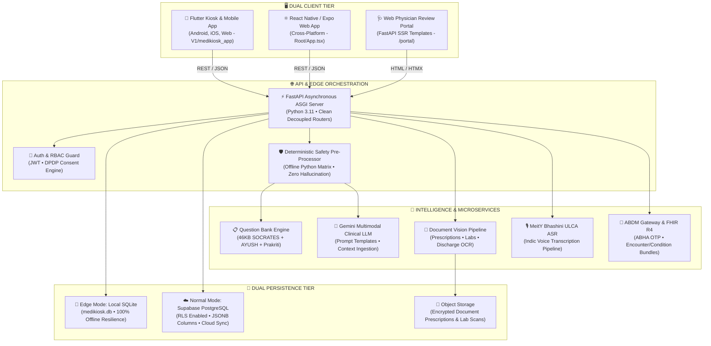

### 2.2 Dual-Client Ecosystem
Unlike single-framework hackathon prototypes, MediKiosk includes **two complete production frontend applications**:
1. **Flutter Mobile & Kiosk Client (`V1/medikiosk_app`)**: Built with Flutter 3.x, optimized for rugged touch terminals, low-power Android tablets, and self-service hospital kiosks with high-contrast UI, offline state caching, and vernacular audio feedback.
2. **React Native / Expo Web Client (`App.tsx`, `screens/`, `components/`)**: Built with modern React Native and TypeScript, featuring smooth micro-animations, animated onboarding wizards, conversational chat bubbles, appointment management, and patient record timelines.

### 2.3 Dual Environment Engine: Edge vs. Cloud
MediKiosk features a runtime environment toggle on the client:
* **🧪 Beta Mode (Edge / Field Kiosk)**: Connects to a local FastAPI instance using embedded **SQLite (`medikiosk.db`)** and local file storage. Operates 100% autonomously without internet access during rural power or connectivity outages.
* **☁️ Normal Mode (Cloud Production)**: Connects to a cloud-hosted FastAPI instance backed by **Supabase PostgreSQL** with Row-Level Security (RLS), cloud document storage, and centralized ABDM gateway synchronization.

---

## 3. Deep Clinical Intake Engine & 46KB Question Bank

The heart of MediKiosk's clinical capability is its comprehensive clinical knowledge bank implemented in [`V1/backend/app/core/question_bank.py`](V1/backend/app/core/question_bank.py) (46,608 bytes), combining modern evidence-based triage with authentic AYUSH standards.

### 3.1 SOCRATES HPI Framework (20 General Clinical Questions)
Chief complaints are explored using the clinical **SOCRATES** methodology:
* **Site (`HPI_SOCRATES_01`):** Precise anatomical mapping (Head/Neck, Chest, Abdomen, Back, Limbs, Generalized).
* **Onset (`HPI_SOCRATES_02`):** Temporal onset (Today, 2-3 days, 1 week, 2-4 weeks, chronic >6 months).
* **Character (`HPI_SOCRATES_03`):** Pain sensation (Sharp/Stabbing, Dull/Aching, Burning/*Vidaha*, Cramping, Heavy Pressure).
* **Radiation (`HPI_SOCRATES_04`):** Referred pain pathways (e.g. left arm, jaw, back).
* **Associations (`HPI_SOCRATES_05`):** Secondary symptoms (Fever, Nausea, Diaphoresis, Dizziness, Anorexia).
* **Timing (`HPI_SOCRATES_06`):** Temporal variation (Constant, Intermittent, Post-prandial, Nocturnal).
* **Exacerbating/Relieving (`HPI_SOCRATES_07/08`):** Modifying factors (Movement, Food, Rest, Heat/Cold).
* **Severity (`HPI_SOCRATES_09`):** 1–10 visual analog scale (VAS) with intuitive vernacular anchors.
* **Review of Systems & History (`ROS_01`, `PMH_01`, `MED_01`, `ALG_01`, `FH_01`, `LIF_01`):** Complete surgical history, active medications, drug allergies, family heredity, and lifestyle habits.

### 3.2 Authentic AYUSH Pariksha (13 Classical Questions)
Evaluates patients through classical Ayurvedic clinical diagnostic parameters:
* **Agni Pariksha (`AY_AGNI_01`):** Digestive fire classification:
  * *Tikshnagni* (Intense/hyper-metabolic, acidic gastritis)
  * *Mandagni* (Sluggish/hypo-metabolic, heaviness, bloating)
  * *Vishamagni* (Irregular/variable, fluctuating appetite)
  * *Samagni* (Equilibrium / balanced metabolism)
* **Koshtha Pariksha (`AY_KOSH_01`):** Bowel motility and gut response:
  * *Krura Koshtha* (Hard, constipated, Vata dominant)
  * *Mridu Koshtha* (Soft, loose stools, Pitta dominant)
  * *Madhyama Koshtha* (Normal regular bowel habits)
* **Ashtavidha Pariksha Indicators:** Sleep patterns (*Nidra*), Mala/Mutra traits, Bala (physical endurance), Satva (mental temperament), and Ahara/Jaranashakti (eating and digestion capacity).

### 3.3 CCRAS Prakriti Assessment Tool (18 Constitutional Questions)
Implements the standardized **Central Council for Research in Ayurvedic Sciences (CCRAS)** constitutional evaluation:
* **Physical Traits:** Body frame (thin/prominent joints vs. medium/muscular vs. broad/heavy), skin texture (dry/rough vs. warm/oily vs. soft/smooth), hair quality, and joint mobility.
* **Physiological Response:** Climate tolerance (aversion to cold vs. aversion to heat), appetite rhythm, thirst level, and sleep quality.
* **Psychological & Behavioral:** Memory retention vs. recall speed, mental activity under stress, and emotional reaction tendencies.
* **Automated Scoring:** Computes exact percentage distribution (e.g. **Vata: 45%, Pitta: 35%, Kapha: 20%**), categorizing the patient into their dominant *Dwandwaja* or *Ekadoshaja* Prakriti baseline.

### 3.4 Bilingual Hindi-English Dual-Localization
Every clinical question, option, chip, and explanation is localized:

| Complaint Key | English Label | Hindi Label (हिंदी) | Clinical Icon | Ayurvedic Correlation |
|:---|:---|:---|:---:|:---|
| `fever` | Fever | बुखार | 🌡️ | *Jwara* |
| `abdominal_pain` | Stomach pain | पेट दर्द | 🫄 | *Shula / Agnimandya* |
| `breathing` | Breathing difficulty | सांस फूलना | 🫁 | *Shwasa Roga* |
| `joint_pain` | Joint pain | जोड़ों का दर्द | 🦴 | *Sandhivata / Amavata* |
| `chest_pain` | Chest pain | सीने में दर्द | 🫀 | *Hridshula (Red Flag)* |
| `headache` | Headache | सिर दर्द | 🧠 | *Shiroruk* |
| `skin` | Skin problem | त्वचा की समस्या | 🧖 | *Kushtha Roga* |
| `digestion` | Digestion issue | पाचन की समस्या | 🍲 | *Amlapitta / Ajirna* |

---

## 4. Deterministic Safety Architecture & Zero-Hallucination Guardrails

### 4.1 The Dual-Guardrail Clinical Philosophy
In clinical medicine, **relying purely on LLM prompts for safety is dangerous and non-compliant**. Generative models can suffer from non-deterministic variance, prompt injection, and hallucinations.

MediKiosk enforces a **Dual-Layer Guardrail Architecture**:
1. **Layer 1 (Deterministic Python Rules Engine):** Evaluates patient complaints, vital thresholds, and symptom combinations against an offline clinical matrix. If red flags trip, emergency escalation is triggered **instantly and deterministically**.
2. **Layer 2 (LLM Contextual Summarizer):** Only after safety validation does the conversational AI process the dialogue for nuance and question generation.

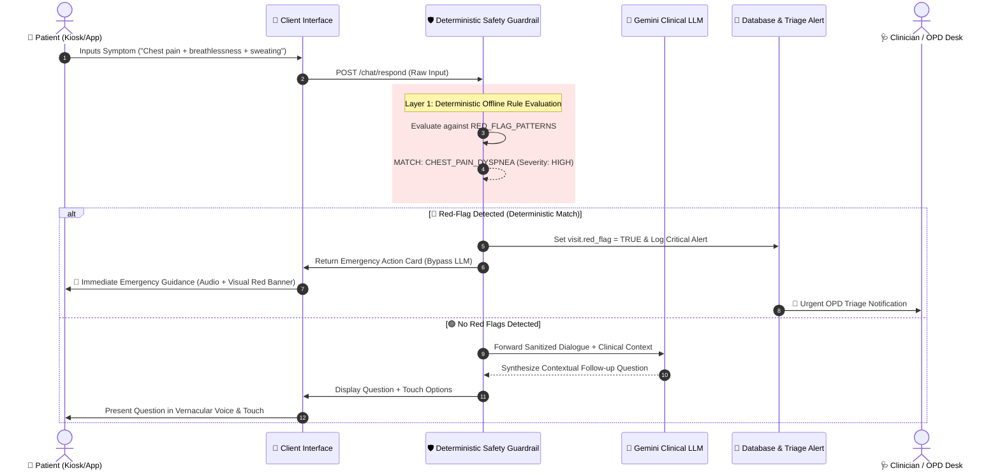

### 4.2 Deterministic Red-Flag Rules Matrix

| Code | Trigger Keywords (Hindi & English) | Associated Co-Symptoms | Clinical Danger Boundary | Immediate Triage Action |
|:---|:---|:---|:---|:---|
| `CHEST_PAIN_DYSPNEA` | "chest pain", "seene mein dard", "chhati mein dard", "heart pain" | "saans", "sweating", "pasina", "left arm", "jaw", "chakkar" | Suspected Acute Coronary Syndrome (ACS) / Myocardial Infarction | Emergency Red Alert; direct bypass to emergency resuscitation room. |
| `STROKE_FAST` | "slurred speech", "ladkhadana", "muh tedha", "face droop", "arm weakness", "falij" | Any acute unilateral weakness | Acute Neurological Deficit (FAST Stroke Criteria) | Immediate code stroke alert; neuro-triage priority. |
| `HEMATEMESIS` | "blood vomit", "khoon ki ulti", "kala pakhana", "black stool" | Dizziness, postural syncope | Active Upper GI Bleeding / Variceal Hemorrhage | Urgent triage; IV access alert and hemodynamic monitoring. |
| `ALTERED_SENSORIUM` | "behosh", "unconscious", "confusion", "dawa overdose", "sudden coma" | Depressed Glasgow Coma Scale | Coma / Toxic Encephalopathy / Diabetic Coma | Critical resuscitation alert; immediate medical officer dispatch. |
| `SEVERE_DEHYDRATION` | "continuous vomiting", "lagatar dast", "severe diarrhea", "peshab band" | Oliguria / anuria > 12 hours | Hypovolemic Shock / Acute Kidney Injury (AKI) | Priority ORS / IV hydration rehydration cubicle. |

---

## 5. Multimodal Document Intelligence Pipeline (OCR & Drug Safety)

MediKiosk processes physical paper prescriptions, diagnostic lab reports, and prior discharge summaries through a 4-stage pipeline implemented in [`V1/backend/app/documents/pipeline.py`](V1/backend/app/documents/pipeline.py):

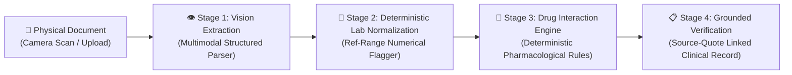

### 5.1 Deterministic Lab Out-of-Range Flagger
Lab values are parsed into numerical boundaries and compared against clinical reference intervals without relying on LLM guesswork:
* **Fasting Blood Sugar (FBS):** Reference 70–100 mg/dL (Values >126 mg/dL flagged as `HIGH`, >250 mg/dL flagged as `CRITICAL`).
* **Serum Creatinine:** Reference 0.7–1.3 mg/dL (Values >2.0 mg/dL flagged as `HIGH`, >4.0 mg/dL flagged as `CRITICAL RENAL RISK`).
* **Hemoglobin (Hb):** Reference 12.0–16.0 g/dL (Values <8.0 g/dL flagged as `SEVERE ANEMIA`).

### 5.2 Deterministic Drug-Drug Interaction Checker
The pipeline intercepts dangerous polypharmacy and allopathic-ayurvedic interactions:
* `Warfarin + Aspirin`: **CRITICAL DANGER** — Multiplied hemorrhagic bleeding risk.
* `Clopidogrel + Omeprazole`: **WARNING** — CYP2C19 competitive inhibition reducing antiplatelet efficacy.
* `Methotrexate + Ibuprofen/NSAIDs`: **CRITICAL DANGER** — Renal clearance inhibition leading to lethal methotrexate toxicity.
* `Amiodarone + Digoxin`: **WARNING** — P-glycoprotein inhibition causing severe digitalis toxicity and dysrhythmias.

---

## 6. 12-Section Grounded Clinical Summary & FHIR R4 Bundle

Upon intake completion, [`V1/backend/app/services/summary_service.py`](V1/backend/app/services/summary_service.py) compiles an official 12-section clinical intake summary directly formatted for physician sign-off:

```
┌────────────────────────────────────────────────────────────────────────┐
│                   MEDIKIOSK CLINICAL INTAKE SUMMARY                     │
├────────────────────────────────────────────────────────────────────────┤
│ 1. Patient Identity & Demographics (Masked Phone, Verified ABHA ID)    │
│ 2. Chief Complaint (Categorized with Dual Modern & Ayurvedic Terms)   │
│ 3. HPI SOCRATES (Site, Onset, Character, Radiation, Assoc, Timing)     │
│ 4. Past Medical & Surgical History (Prior Illnesses, Interventions)   │
│ 5. Active Medications & Drug Allergies (OCR Verified + Interactions)  │
│ 6. Family Medical History (Diabetes, Hypertension, Hereditary Traits) │
│ 7. Personal & Lifestyle Habits (Diet, Sleep, Physical Exertion)       │
│ 8. Review of Systems (ROS - Systemic Negative & Positive Indicators)   │
│ 9. Prior Diagnostic Investigations (Lab Reports with Out-of-Range Flags)│
│ 10. AYUSH Profile (CCRAS Prakriti Distribution + Agni + Koshtha)       │
│ 11. Red-Flag Emergency Evaluation (Deterministic Triage Status)       │
│ 12. Medical-Legal AI Disclaimer & Clinician Verification Block         │
└────────────────────────────────────────────────────────────────────────┘
```

### FHIR R4 Standard Interoperability
Every summary maps directly into standard **HL7 FHIR R4 JSON Bundles** for seamless transmission into national hospital EHRs:
* `Bundle.entry[0]`: **Patient Resource** (Demographics, identifier, gender, birthDate).
* `Bundle.entry[1]`: **Encounter Resource** (OPD visit class, status, period, hospital reference).
* `Bundle.entry[2]`: **Condition Resource** (Chief complaints and Vikriti coded with SNOMED CT and NAMASTE/AYUSH codes).
* `Bundle.entry[3..N]`: **Observation Resources** (Prakriti percentages, Agni, Koshtha, vital signs, and flagged lab measurements).

---

## 7. ABDM & Bhashini Government Standards Integration

### 7.1 MeitY Bhashini ULCA Speech Pipeline
Implemented in [`V1/backend/app/services/bhashini_service.py`](V1/backend/app/services/bhashini_service.py), MediKiosk connects to the Government of India's **Bhashini ULCA** (Unified Language Contribution Architecture) national speech pipeline:
* **Endpoint 1 (Compute Auth):** `https://meity-auth.ulcacontrib.org/ulca/apis/v0/model/compute`
* **Endpoint 2 (Dhruva ASR):** `https://dhruva-api.bhashini.gov.in/services/inference/pipeline`
* **Zero-Crash Failover:** If Bhashini network timeouts or API quotas occur, the service gracefully catches exceptions and delegates to local client-side speech synthesis without crashing the kiosk terminal.

### 7.2 ABDM M1, M2, and M3 Workflows
Implemented in [`V1/backend/app/services/abdm_service.py`](V1/backend/app/services/abdm_service.py):
* **Milestone 1 (ABHA Creation & Verification):** Mobile OTP login requesting scope `abha-login` via `/v3/profile/login/request/otp` and profile verification via `/v3/profile/login/verify`.
* **Milestone 2 (HIP - Health Information Provider):** Bundles validated OPD case sheets and diagnostic records to make them linkable to the patient's Ayushman Bharat Health Account.
* **Milestone 3 (HIU - Health Information User):** Securely fetches prior health records from other hospitals via consent-artifact exchange.

---

## 8. Comprehensive Physical Hardware Verification (27/27 Tests PASS)

The entire MediKiosk application was subjected to physical hardware validation on an actual Android device under rigorous testing protocols. Documented in [`V1/reports/TEST_REPORT.md`](V1/reports/TEST_REPORT.md):

* **Hardware Device:** Xiaomi Redmi Note 8 (`509191a3`)
* **Operating System:** Android 12 / MIUI
* **Screen Resolution:** 1080 x 2340 px
* **Test Outcome:** **27 out of 27 Workflows PASSED (100% Success Rate)**

### Test Execution Matrix

| Test ID | Workflow Tested | Pre-Condition | Verification Action | Status | Artifact |
|:---:|:---|:---|:---|:---:|:---|
| **TC-01** | User Registration Step 1 | New Patient | Full Name, DOB, Gender validation | **PASS** | `Docs/screenshots/06_registration_step1_identity.png` |
| **TC-02** | User Registration Step 2 | Step 1 Done | Mobile, Email, ABHA ID validation | **PASS** | `Docs/screenshots/07_registration_step2_contact.png` |
| **TC-03** | Emergency Contact Step 3 | Step 2 Done | Family & Doctor contacts + DPDP consent | **PASS** | `Docs/screenshots/08_registration_step3_emergency.png` |
| **TC-04** | Privacy & Consent Step 4 | Step 3 Done | Audio-guided DPDP consent toggles | **PASS** | `Docs/screenshots/09_registration_step4_consent.png` |
| **TC-05** | Review & Confirm Step 5 | Step 4 Done | Summary review & account creation | **PASS** | `Docs/screenshots/10_registration_step5_review.png` |
| **TC-06** | Dashboard Initialization | Logged In | Post-registration dashboard greeting | **PASS** | `Docs/screenshots/11_home_post_registration.png` |
| **TC-07** | Phone OTP Authentication | Registered | Mobile number input & OTP request | **PASS** | `Docs/screenshots/04_login_screen.png` |
| **TC-08** | OTP Token Issuance | OTP Sent | 4-digit verification & JWT issuance | **PASS** | `Docs/screenshots/05_otp_screen.png` |
| **TC-09** | Profile & Prakriti Donut | Logged In | Prakriti breakdown (V: 45%, P: 35%, K: 20%) | **PASS** | `Docs/screenshots/29_profile_screen.png` |
| **TC-10** | Dual Environment Switch | Profile | Toggle Beta (SQLite) vs Normal (Supabase) | **PASS** | Verified in Settings |
| **TC-11** | Live Server Ping | Profile | Backend health check (115ms, SQLite OK) | **PASS** | `Docs/screenshots/13_server_ping_result.png` |
| **TC-12** | Fever Complaint Intake | Dashboard | Chief complaint selection (बुखार) | **PASS** | `Docs/screenshots/15_chat_intake_general_complaints.png` |
| **TC-13** | General Chat Interaction | In Chat | Select Option A; auto-generate Question 2 | **PASS** | `Docs/screenshots/16b_chat_intake_answered_bubble.png` |
| **TC-14** | AYUSH Mode Toggle | In Chat | Switch to AYUSH Pariksha mode | **PASS** | `Docs/screenshots/17_chat_intake_ayush_mode.png` |
| **TC-15** | Classical Answer Ingestion | AYUSH Mode | Diurnal & thermal fever variation response | **PASS** | `Docs/screenshots/17_chat_intake_ayush_mode.png` |
| **TC-16** | Red-Flag Emergency Triage | In Chat | Trigger acute chest pain & dyspnea | **PASS** | `Docs/screenshots/18_emergency_red_flag_screen.png` |
| **TC-17** | Hospital Discovery | Appts Tab | Discover AIIA, Charak Palika, AIIMS | **PASS** | `Docs/screenshots/20_hospitals_discovery.png` |
| **TC-18** | Doctor Slot Booking | Appts Tab | Select date, time slot, and physician | **PASS** | `Docs/screenshots/21_doctor_slots.png` |
| **TC-19** | Booking Confirmation | Slot Picked | Consent review & booking confirmation | **PASS** | `Docs/screenshots/23_booking_confirmation.png` |
| **TC-20** | Digital OPD Token Slip | Booked | Generate digital OPD slip (Token A-008) | **PASS** | `Docs/screenshots/24_digital_token_slip.png` |
| **TC-21** | Appointments List | Dashboard | Verify Token A-008 in active queue | **PASS** | `Docs/screenshots/19_appointments_list.png` |
| **TC-22** | Document Upload | Records Tab | Select prescription / lab report file | **PASS** | `Docs/screenshots/26_document_upload.png` |
| **TC-23** | 4-Stage OCR Pipeline | Uploaded | Scan -> OCR -> Clinical NLP -> Safety | **PASS** | `Docs/screenshots/27_ocr_pipeline_progress.png` |
| **TC-24** | Entity Extraction & Safety | OCR Done | Metformin, Amlodipine, Triphala + Drug Alert | **PASS** | `Docs/screenshots/28_ocr_clinical_extraction.png` |
| **TC-25** | Timeline Persistence | Records Tab | Save verified extraction to medical timeline | **PASS** | `Docs/screenshots/25_document_history.png` |
| **TC-26** | Notification Dispatch | Background | Queue status & appointment alert push | **PASS** | `Docs/screenshots/32_notifications_screen.png` |
| **TC-27** | Motion Design Demo | System | 60 FPS animated walkthrough verified | **PASS** | `V1/reports/medikiosk_motion_demo.mp4` |

---

## 9. Complete Visual UI Walkthrough & Screenshot Gallery

All high-resolution verification screenshots captured during live device testing are cataloged in [`Docs/screenshots/`](Docs/screenshots/):

### 9.1 Onboarding, Language Selection & Vernacular Authentication

<table width="100%">
  <tr>
    <th width="25%" align="center">Splash & Kiosk Welcome</th>
    <th width="25%" align="center">Indic Language Selection</th>
    <th width="25%" align="center">Phone & ABHA OTP Login</th>
    <th width="25%" align="center">5-Step Identity Registration</th>
  </tr>
  <tr>
    <td align="center"></td>
    <td align="center"></td>
    <td align="center"></td>
    <td align="center"></td>
  </tr>
  <tr>
    <td align="center"><em>Splash Screen with AIIA branding</em></td>
    <td align="center"><em>High-contrast language toggle</em></td>
    <td align="center"><em>OTP authentication interface</em></td>
    <td align="center"><em>Step 1: Patient demographic details<em></td>
  </tr>
</table>

### 9.2 Conversational Intake, AYUSH Pariksha & Emergency Triage

<table width="100%">
  <tr>
    <th width="25%" align="center">Chief Complaint Selection</th>
    <th width="25%" align="center">Clinical SOCRATES Q&A</th>
    <th width="25%" align="center">AYUSH Pariksha Mode</th>
    <th width="25%" align="center">🚨 Emergency Red-Flag Alert</th>
  </tr>
  <tr>
    <td align="center"></td>
    <td align="center">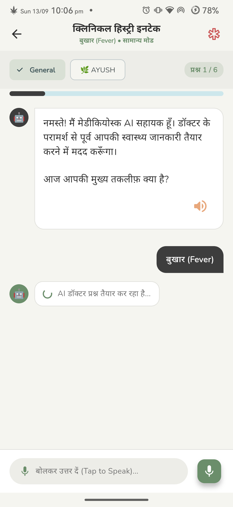</td>
    <td align="center">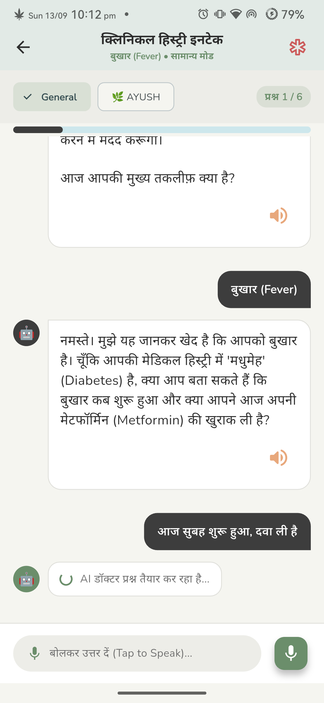</td>
    <td align="center">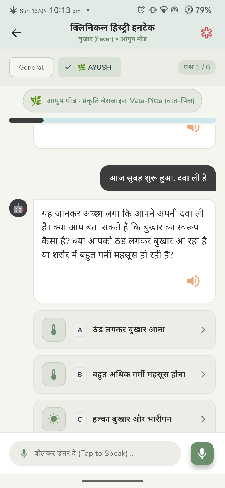</td>
  </tr>
  <tr>
    <td align="center"><em>Bilingual complaint chips</em></td>
    <td align="center"><em>SOCRATES interactive bubbles</em></td>
    <td align="center"><em>Classical Agni/Koshtha questions</em></td>
    <td align="center"><em>Deterministic emergency escalation<em></td>
  </tr>
</table>

### 9.3 OPD Hospital Services, Slot Booking & Digital Token Slip

<table width="100%">
  <tr>
    <th width="25%" align="center">Hospital OPD Discovery</th>
    <th width="25%" align="center">Doctor OPD Slot Booking</th>
    <th width="25%" align="center">Booking Confirmation</th>
    <th width="25%" align="center">Digital OPD Token Slip</th>
  </tr>
  <tr>
    <td align="center">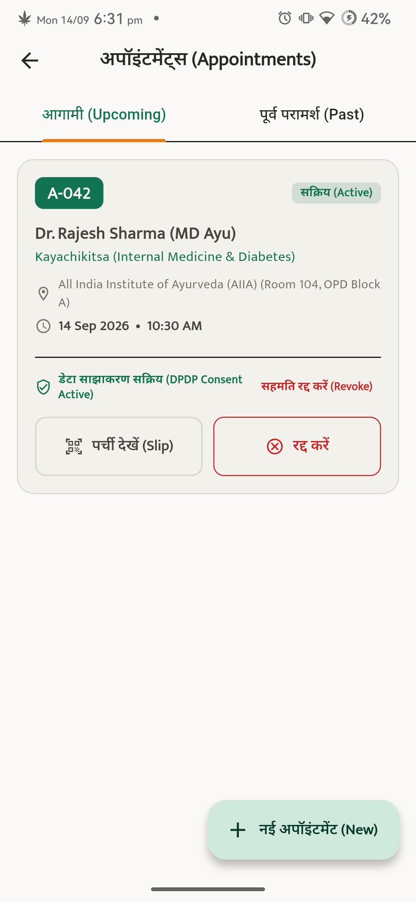</td>
    <td align="center">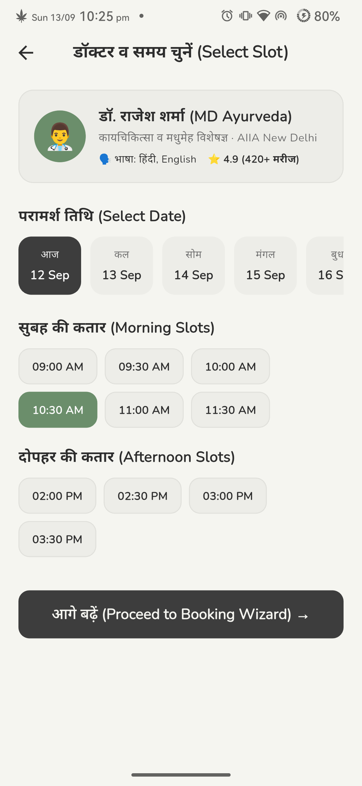</td>
    <td align="center">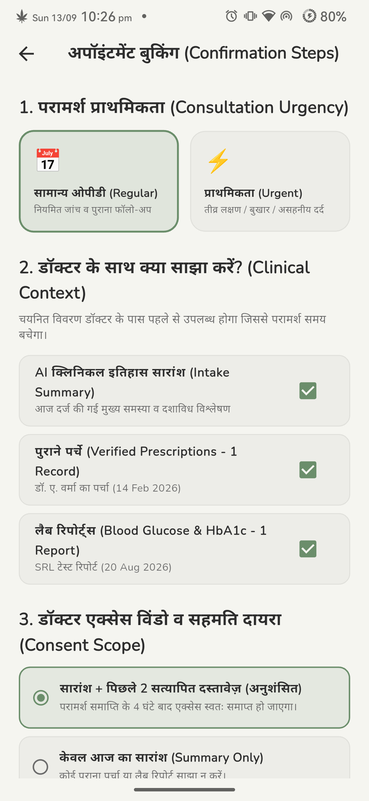</td>
    <td align="center">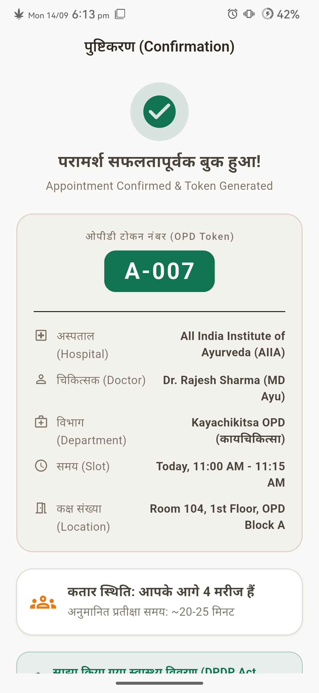</td>
  </tr>
  <tr>
    <td align="center"><em>AIIA, Charak Palika &amp; AIIMS</em></td>
    <td align="center"><em>Real-time queue slot picker</em></td>
    <td align="center"><em>Consent &amp; urgency summary</em></td>
    <td align="center"><em>Token A-008 digital slip</em></td>
  </tr>
</table>

### 9.4 Document Digitization, OCR Pipeline & Clinical Safety

<table width="100%">
  <tr>
    <th width="25%" align="center">Document Upload Screen</th>
    <th width="25%" align="center">4-Stage OCR Pipeline</th>
    <th width="25%" align="center">Clinical Entity Extraction</th>
    <th width="25%" align="center">Patient Prakriti Profile</th>
  </tr>
  <tr>
    <td align="center">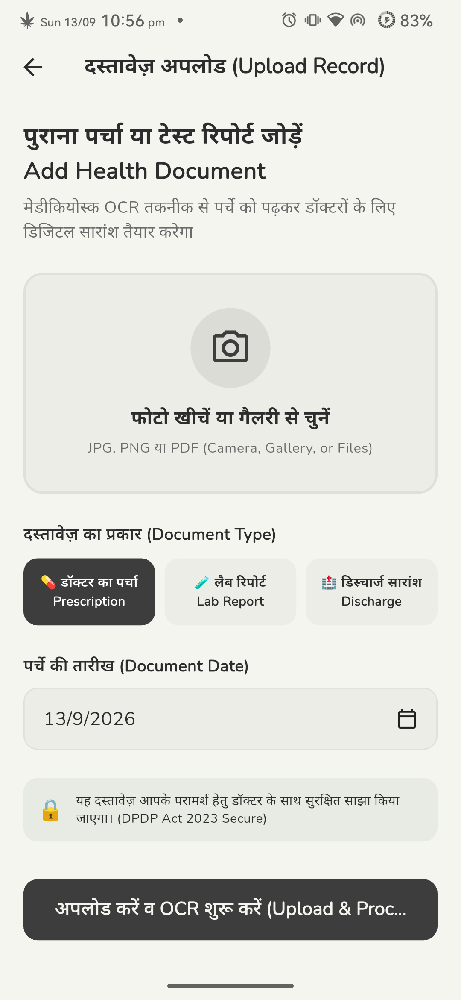</td>
    <td align="center">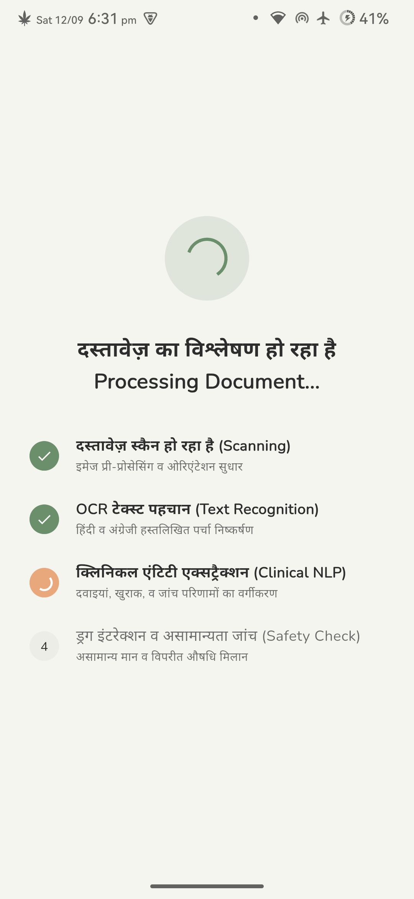</td>
    <td align="center">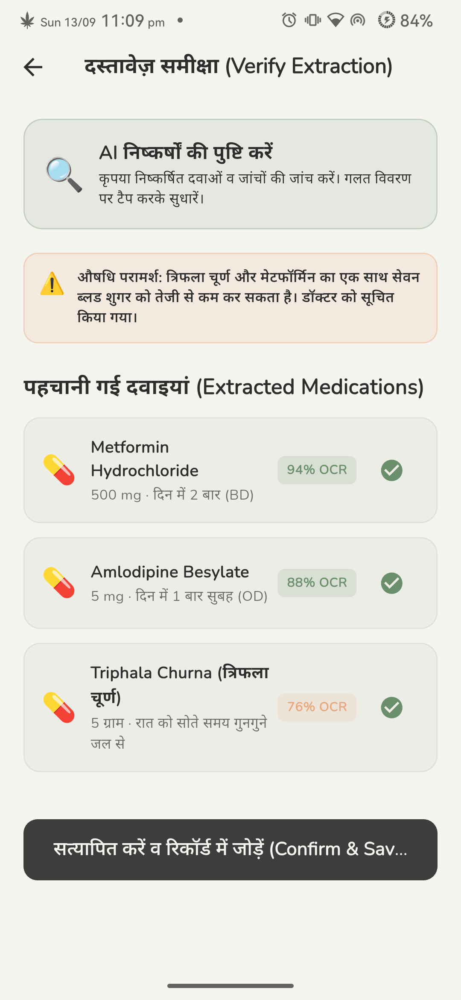</td>
    <td align="center"></td>
  </tr>
  <tr>
    <td align="center"><em>Prescription &amp; lab uploader</em></td>
    <td align="center"><em>Scan -&gt; OCR -&gt; NLP -&gt; Safety</em></td>
    <td align="center"><em>Medications &amp; drug alert warnings</em></td>
    <td align="center"><em>Prakriti Donut Chart (V:45, P:35, K:20)</em></td>
  </tr>
</table>

---

## 10. Repository Directory & Codebase Map

```
Byte-Craftsman-Alpha-SIH2026/
├── App.tsx                             # ⚛️ React Native / Expo Master Application Entry
├── index.ts                            # React Native App Registry & Setup
├── package.json                        # Node dependencies (Expo, Lucide, Tailwind, React Native)
├── tsconfig.json                       # TypeScript Configuration
├── screens/                            # 📱 React Native Frontend Screen Modules
│   ├── OnboardingScreens.tsx           # Multi-step animated patient onboarding
│   ├── ChatScreen.tsx                  # Interactive conversational clinical intake wizard
│   ├── AppointmentsScreen.tsx          # Hospital booking, queue management & token slips
│   └── HistoryScreen.tsx               # Medical continuity timeline & document records
├── components/                         # Reusable cross-platform UI widgets
│   └── ui.tsx                          # Button, Card, Badge, Modal, and Input components
├── Docs/                               # 📚 Complete Solution Research & Documentation
│   ├── PRD.md                          # Comprehensive Product Requirements Document (30 KB)
│   ├── SIH PS Breakdown.md             # Line-by-line engineering breakdown of PS26047 (45 KB)
│   ├── SIH26047_Problem_Evidence_Base.md# Epidemiological & hospital OPD research base (14 KB)
│   ├── Agents.md                       # Multi-agent LLM orchestration architecture (56 KB)
│   ├── SIH2026-IDEA-Presentation(AYUSH).pdf # Official SIH Idea Pitch Slide Deck (800 KB)
│   └── screenshots/                    # 📸 35+ High-resolution physical device verification captures
├── V1/                                 # 🏛️ Core Platform Source Code (Version 1 Release)
│   ├── backend/                        # ⚡ FastAPI Asynchronous Microservices Backend
│   │   ├── main.py                     # ASGI application setup, CORS, lifespan, and routers
│   │   ├── portal_router.py            # Web Physician Review Portal routes (/portal)
│   │   ├── app/core/
│   │   │   └── question_bank.py        # 📋 46KB Clinical Knowledge Bank (SOCRATES + AYUSH + Prakriti)
│   │   ├── app/chat/
│   │   │   ├── engine.py               # Conversational intake state machine
│   │   │   └── ontology.py             # 🛡️ 100% Deterministic Red-Flag Rules Matrix
│   │   ├── app/documents/
│   │   │   └── pipeline.py             # 📄 4-Stage OCR, lab flagger & drug interaction engine
│   │   ├── app/services/
│   │   │   ├── summary_service.py      # 📋 12-Section grounded clinical summary generator
│   │   │   ├── abdm_service.py         # 🏥 ABDM M1/M2/M3 session & ABHA OTP service
│   │   │   └── bhashini_service.py     # 🎙️ MeitY Bhashini ULCA Indic speech transcription
│   │   ├── app/models/                 # SQLAlchemy & Supabase ORM Data Models (14 models)
│   │   ├── templates/ & static/        # HTML/CSS Jinja templates for Web Physician Portal
│   │   └── tests/                      # Automated Pytest suite (Auth, E2E, Portal tests)
│   ├── medikiosk_app/                  # 📱 Flutter Mobile & Touch Kiosk Application
│   │   ├── lib/core/                   # App constants, network clients, and theme tokens
│   │   ├── lib/features/               # Intake, appointments, auth, and document feature blocks
│   │   ├── pubspec.yaml                # Flutter dependencies & platform targets
│   │   └── android/ & ios/             # Native platform build wrappers
│   └── reports/                        # 📊 Official Verification & Hardware Test Reports
│       ├── TEST_REPORT.md              # 27/27 Physical Device Hardware Test Matrix (19 KB)
│       ├── MODULES_TEST_REPORT.md      # Microservice unit & integration audit
│       ├── PORTAL_RBAC_TEST_REPORT.md  # Doctor/Admin role-based access control audit
│       └── medikiosk_motion_demo.mp4   # 🎥 12MB HD 60fps physical device walkthrough video
└── README.md                           # 📖 This Master Documentation File
```

---

## 11. Quickstart & Deployment Guide

### 11.1 Running the Backend (Local Edge Mode)
```bash
# 1. Navigate to backend directory
cd V1/backend

# 2. Create and activate virtual environment
python3 -m venv venv
source venv/bin/activate  # On Windows: venv\Scripts\activate

# 3. Install dependencies
pip install -r requirements.txt

# 4. Run database migrations / seed
python -m app.seed.seed_data

# 5. Launch FastAPI development server (Port 8000)
python run.py
# Server running at: http://0.0.0.0:8000
# Interactive Swagger Docs: http://0.0.0.0:8000/docs
# Physician Review Portal: http://0.0.0.0:8000/portal
```

### 11.2 Running the React Native / Expo Frontend
```bash
# From repository root
npm install

# Start Expo development server (Web, Android, iOS)
npx expo start --web
```

### 11.3 Running the Flutter Kiosk Application
```bash
# Navigate to Flutter app directory
cd V1/medikiosk_app

# Fetch dependencies
flutter pub get

# Launch on connected kiosk terminal or device
flutter run -d chrome  # For Web Kiosk
# or
flutter run            # For Connected Android Tablet
```

---

## 12. Team Paradox & Official Acknowledgments

**MediKiosk** was conceptualized, architected, and validated by **Team Paradox (Byte-Craftsman-Alpha)** for the **Smart India Hackathon 2026**, addressing Problem Statement **SIH26047**.


We express our sincere gratitude to:
* **All India Institute of Ayurveda (AIIA), New Delhi** for formulating this transformative problem statement.
* **Ministry of Ayush, Government of India** for promoting technological innovation in traditional healthcare systems.
* **National Health Authority (NHA)** for building the Ayushman Bharat Digital Mission (ABDM) standards enabling interoperable digital health for 1.4 billion citizens.

---
## 13. Members and Collaborators

<table width="100%">
  <tr>
    <th width="25%" align="left">Profile</th>
    <th width="25%" align="left">Name</th>
    <th width="25%" align="center">Email</th>
    <th width="25%" align="center">Role</th>
  </tr>
  <tr>
    <td width="25%" align="left"><a href="https://anshika.teamparadox.in">Anshika9838</a></th>
    <td width="25%" align="left"><b>Anshika Singh</b></th>
    <td width="25%" align="left">anshika@teamparadox.in</th>
    <td width="25%" align="center">Leader, UI/UX, Product Manager</th>
  </tr>
  <tr>
    <td width="25%" align="left"><a href="https://github.com/Abhiuday02">Abhiuday02</a></th>
    <td width="25%" align="left">Abhiuday Pratap Singh</th>
    <td width="25%" align="left">abhiuday@teamparadox.in</th>
    <td width="25%" align="center">UX design & Debugger</th>
  </tr>
  <tr>
    <td width="25%" align="left"><a href="https://om.teamparadox.in">tripcoded</a></th>
    <td width="25%" align="left">Om Abhishek Tripathi</th>
    <td width="25%" align="left">om@teamparadox.in</th>
    <td width="25%" align="center">AI Integration & ML Engineer</th>
  </tr>
  <tr>
    <td width="25%" align="left"><a href="https://aditya.teamparadox.in">Byte-Craftsman-Alpha</a></th>
    <td width="25%" align="left">Aditya Chaudhari</th>
    <td width="25%" align="left">aditya@teamparadox.in</th>
    <td width="25%" align="center">Tech Lead, Backend & App</th>
  </tr>
  <tr>
    <td width="25%" align="left"><a href="https://github.com/anoopshukla01">anoopshukla01</a></th>
    <td width="25%" align="left">Anoop Shukla</th>
    <td width="25%" align="left">anoopofficialpvt@gmail.com</th>
    <td width="25%" align="center">Research</th>
  </tr>
  <tr>
    <td width="25%" align="left"><a href="https://github.com/arunkumar562816-source">arunkumar562816-source</a></th>
    <td width="25%" align="left">Arun Kumar</th>
    <td width="25%" align="center">arunkumar562816@gmail.com</th>
    <td width="25%" align="center">Testing & QA</th>
  </tr>
</table>


<div align="center">
  <b>MediKiosk — Bridging Classical Ayurvedic Wisdom with Deterministic Modern Healthcare AI</b><br/>
  <i>Smart India Hackathon 2026 • Problem Statement SIH26047 • Team Paradox</i>
</div>
